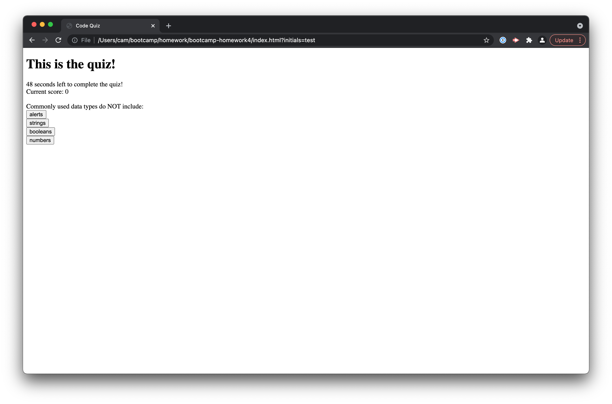

# bootcamp-homework4
Javascript based Code Quiz

This application allows a user to take a coding quiz. The quiz is scored and timed, and users lose time for incorrect answers. Upon completion of the quiz, users can submit their initials to save their high score, and see other local high scores.

The application can be found [here](https://caaam.github.io/bootcamp-homework4/).